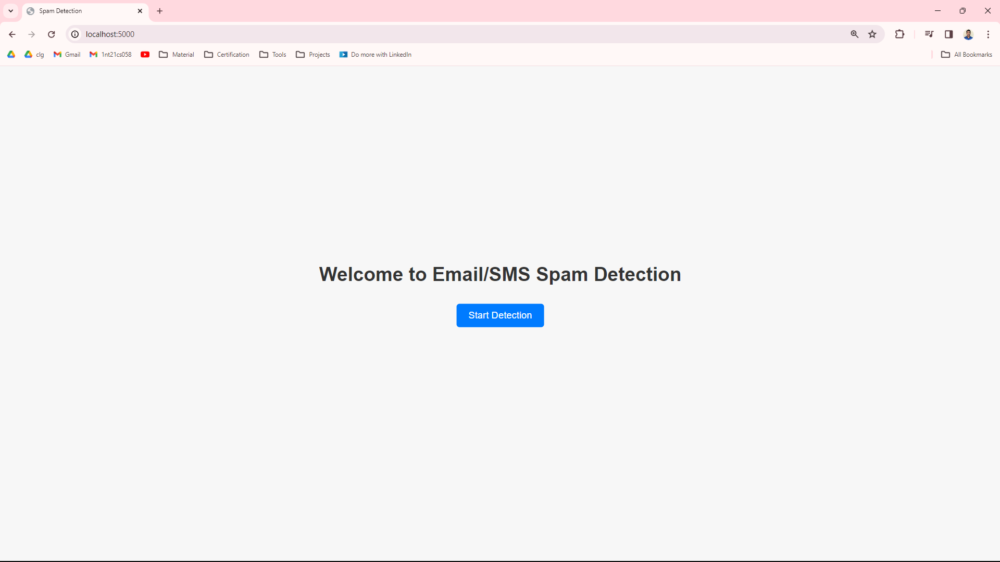
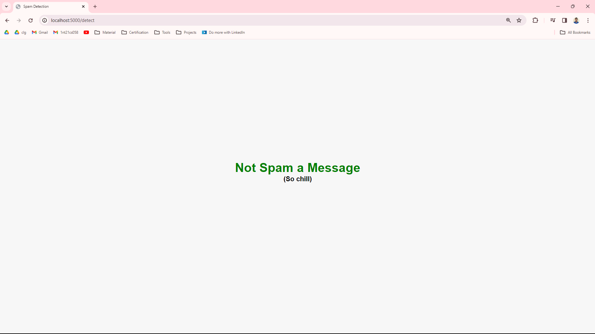
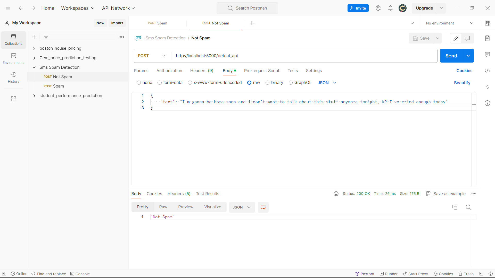
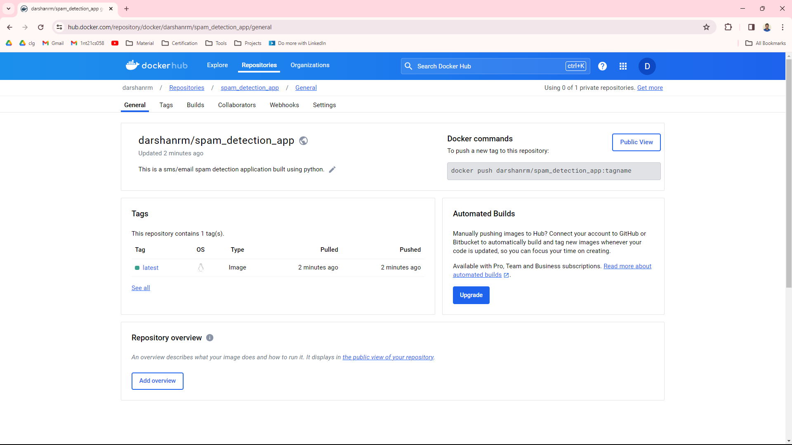
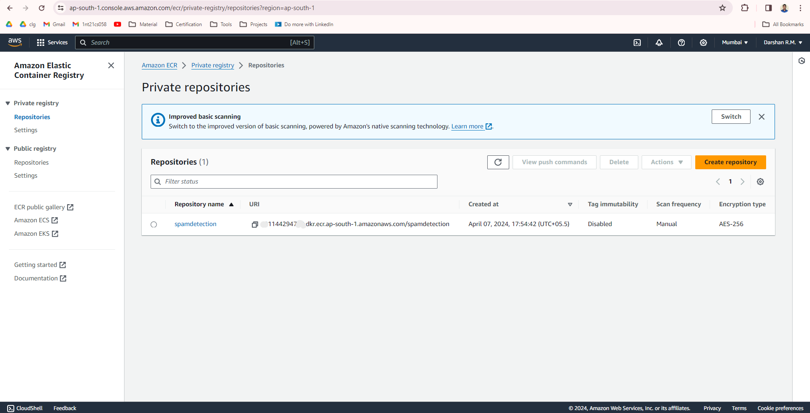
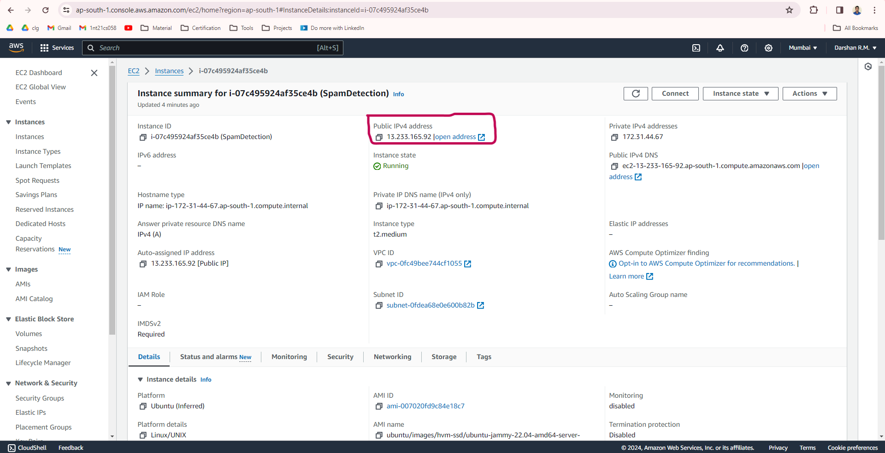
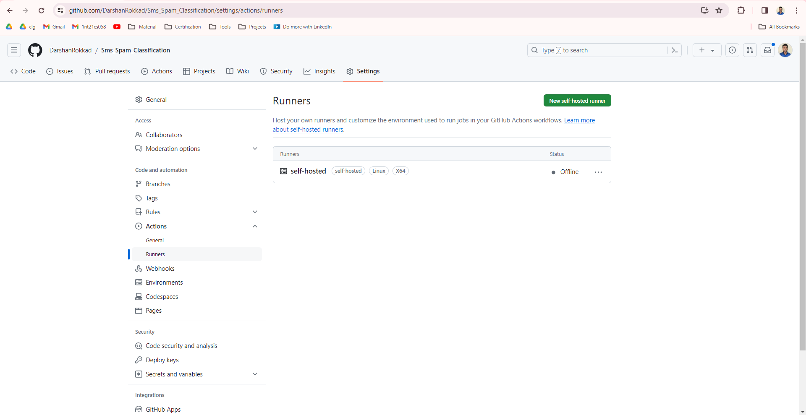
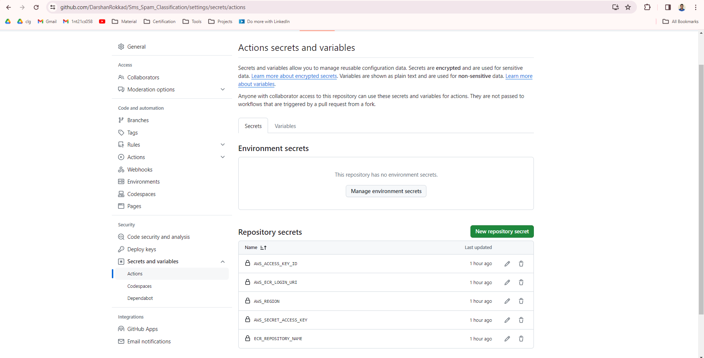
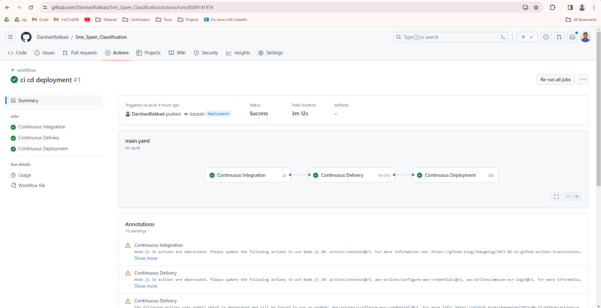

<h1 align="center">:rocket: SMS/Email Spam Classification Project :rocket:</h1>

---

<h3 align="center">Problem Statement</h3>

Given a input text message/email we have to detect whether it is a spam or not a spam.

---

<h3 align="center">Solution Explaination</h3>

Research Paper -> https://ieeexplore.ieee.org/document/10390514

Click the below image to see vedio solution explaination 

[](https://www.youtube.com/embed/______)

---

<h3 align="center">Approch for the problem</h3>

Explain the problem solving approch

---

<h3 align="center">Project UI</h3>

<p align="center"></p>
<p align="center"></p>
<p align="center"></p>
<p align="center"></p>
<p align="center"></p>

---

<h3 align="center">API Testing Results</h3>

<p align="center"></p>  
<p align="center"></p>

---

<h3 align="center">Mlflow and Dags Hub integration</h3>

<p align="center">Mlflow is used to mointer my Machine Learning Lifecycle and dags hub is a remote repository.</p>
<p align="center"></p>  
<p align="center"></p>
<p align="center"></p>
<p align="center"></p>
<p align="center"></p>

---

<h3 align="center">Docker image publishing</h3>

<p align="center">Step 1 : Built a docker image on local machine and tested the application.</p>
<p align="center"></p>  
<p align="center">Step 2 : Pushed tested docker image to the public docker hub.</p>
<p align="center"></p>
<p align="center">This docker image is present in docker hub publically anyone can just pull this image and use the project, it's open sourced.</p>
<p align="center">The command to run the pulled docker image is "docker run -p 5000:5000 darshanrm/spam_detection_app:latest"</p>

---

<h3 align="center">Deployment Application On AWS<br><br>Using ECR + EC2 + Github action[CI-CD pipeline]<br></h3>  

<p align="center">Step 1 : Created a IAM role and downloaded access key and secret key.</p>
<p align="center"></p>  
<p align="center">Step 2 : Created a ECR private registory to store docker image privately(can also be pull image present in the docker hub).</p>
<p align="center"></p>  
<p align="center">Step 3 : Created a EC2 instance to build docker and run my application.</p>
<p align="center"></p>  
<p align="center">Step 4 : Configured EC2 instance by installing docker dependencies and also creating github self hosted runner.</p>
<p align="center"></p>  
<p align="center">Step 5 : Can see the github self hosted runner in below image which is result of the above step.</p>
<p align="center"></p>  
<p align="center">Step 6 : Added github repository secrets which are used in the github workflow.</p>
<p align="center"></p>  
<p align="center">Step 7 : Can see successfully runned CI-CD pipeline in below image.</p>
<p align="center"></p>  
<p align="center">Step 8 : Accessed spam detection application using public IPv4 address.</p>
<p align="center"></p>   

---

<h3 align="center">Project Structure</h3>

```
│  
├── .github/workflow/main.yaml               <-- For Continous Integration, Continous Delivery and Contious Deployment.
│  
├── artificats                               <-- Contains dataset(train, test , modified and raw) and pickle files(vectorizer and model).
│  
├── images                                   <-- Contains images used in readme file.
│  
├── notebooks                                <-- Folder contains a jupyter notebook where eda and model training is performed.
│  
├── resources                                <-- Folder contains some usefull commands and steps used while build project.
│   
├── src
│   │
│   ├── components
│   │   │
│   │   ├── __init__.py
│   │   │
│   │   ├── data_ingestion.py                <-- First component of training pipeline which reads data from source and does train test split. 
│   │   │
│   │   ├── data_transformation.py           <-- Second component of training pipeline which takes train and test data and transform them into data which can be used to train model.
│   │   │
│   │   ├── model_training.py                <-- Third component of training pipeline which will use different machine learning algorithm
│   │   │                                        and train algorithms with transformed data and select best model and save that model of prediction
│   │   │
│   │   └── model_evaluation.py              <-- Fourth component of training pipeline which is used to evaluate the best model and save the performance metrics.
│   │
│   ├── pipeline
│   │   │
│   │   ├── __init__.py
│   │   │
│   │   ├── training_pipeline.py             <-- This pipeline is used to train model by combining all the components present in the components folder.
│   │   │
│   │   └── prediction_pipeline.py           <-- This pipeline uses the vectorizer and model which are obtained after training and does prediction and returns the prediction to application.  
│   │
│   ├── __init__.py
│   │
│   ├── exception.py                         <-- Exception module is contains a class which can be used to raise custom exceptions.
│   │
│   ├── logger.py                            <-- Logger module is used for logging and dugging which can be used to log various information.
│   │
│   └── utils.py                             <-- Utils module contains the commonly used methods in the project.
│   
├── static
│   │
│   └── css                                  <-- Folder contains all css files.
│   
├── templates                                <-- Folder contains all the html files.
│   
├── .gitignore                               <-- Used to ignore the file which are not needed to push to github.
│
├── application.py                           <-- Contains flask web application to take input from user and render output.
│
├── LICENSE                                  <-- Copyright license for the github repository.
│
├── README.md                                <-- Used to display the information about the project.
│
├── requirements.txt                         <-- Text file which contain the dependencies/packages used in project. 
│
├── setup.py                                 <-- Python script used for building python package of our project.
│
└── template.py                              <-- Program used to create our the project structure.
```

---
